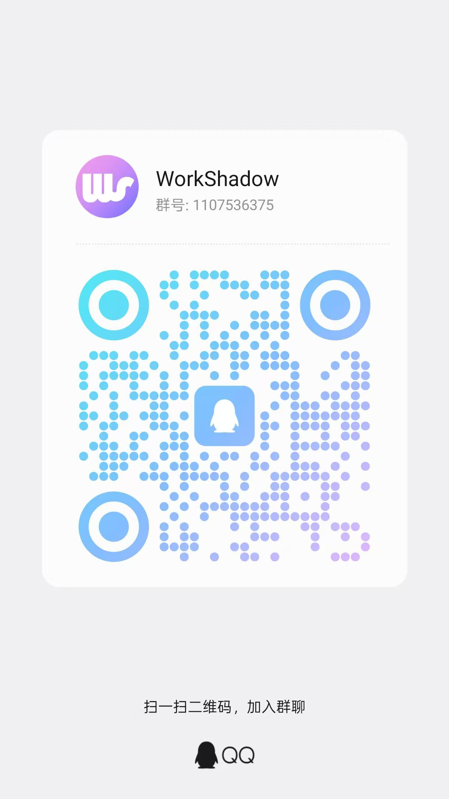

<p align="center">
  
</p>

<p align="center">
  <a href="https://futureuniant.github.io/WorkShadow/">Project site</a>
  &nbsp;·&nbsp;
  <a href="README.md">中文</a> | <strong>English</strong>
</p>

<h1 align="center">WorkShadow</h1>

<p align="center">
  <strong>Like a shadow—records what you do, understands what you need.</strong>
</p>

WorkShadow is a **local-first** desktop work journal. Manage entries on the left and write in a rich-text editor on the right—daily work, decisions, issues, and notes. Data stays on your machine; for AI features (search, summaries, Q&A, image descriptions, and more), connect your own model services in Settings—**you own the content, you choose the capabilities**.

---

## How is WorkShadow different from typical notes / docs tools?

| Common pain point | What WorkShadow does |
|-------------------|----------------------|
| Easy to write, hard to find later | **Keyword search + semantic retrieval**—find details from months ago in one query |
| Digging through files for daily / weekly reports, emails, updates | **Workspace · Log summary**—select multiple logs and draft reports to your spec |
| “Why did we decide that back then?” | **Workspace · Log Q&A**—ask your history; get broader, connected answers |
| Worried about cloud lock-in or uploads | **Data stays local**; AI calls the network only when you configure models |
| Backup and migration | **`.ws` full backup** with merge import |

WorkShadow is not a general-purpose Word or Notion replacement—it is a **work journal companion** for ongoing capture, review, and reporting: smooth writing, fast finding, easier summaries, with data and model choice always in your hands.

<p align="center">
  
</p>

---

## Installer vs development build

The **[installer](https://github.com/FutureUniant/WorkShadow/releases)** (Releases package) and **[development build](https://github.com/FutureUniant/WorkShadow/releases)** (`npm run tauri dev` or dev installer) share the same core features and are **both free**. The installer is **optimized for smoother, more fluid editing**; it also adds smart completion and onboarding (✅ yes / ❌ no):

| | [Dev build](https://github.com/FutureUniant/WorkShadow/releases) | [Installer](https://github.com/FutureUniant/WorkShadow/releases) | Notes |
|---|:---:|:---:|------|
| Price | 🆓 | 🆓 | |
| Core features | ✅ | ✅ | |
| Editing performance | ❌ | ✅ | Smoother, more fluid editing |
| More user-friendly, more polished UI & interactions | ❌ | ✅ | Smoother day-to-day experience |
| Image copy/paste & drag-and-drop | ❌ | ✅ | Paste or drag images into the editor |
| Smart completion | ❌ | ✅ | Local; smarter over time |
| Onboarding | ❌ | ✅ | |
| Data on device | ✅ | ✅ | |
| How to run | [Download](https://github.com/FutureUniant/WorkShadow/releases) / from source | [Download](https://github.com/FutureUniant/WorkShadow/releases) | |
| Best for | Development | Daily use | |

Completion and onboarding learn on your machine—log bodies are not uploaded. AI features are enabled only when you configure models in Settings.

---

## Features

### Log organization & editing

- **Smart completion** (**[installer](https://github.com/FutureUniant/WorkShadow/releases) only**): Suggests continuations at the cursor based on logs already saved locally; learning and inference stay on-device—no body text upload. **The more you use it, the better it matches your style.** Not included in the [development build](https://github.com/FutureUniant/WorkShadow/releases).
- **Rich text**: Headings, lists, task lists, quotes, code blocks, tables, links, images, video, math, and more.
- **Image copy/paste & drag-and-drop** (**[installer](https://github.com/FutureUniant/WorkShadow/releases) only**): Paste images from the clipboard or drag image files into the editor. Not included in the [development build](https://github.com/FutureUniant/WorkShadow/releases).
- **Batch actions**: Multi-select nodes to move or delete in bulk.
- **Import Markdown**: Bring existing `.md` files into a log entry and keep editing.

### Search & understanding

- **Keyword search**: Type in the left search box for local keyword matches with multiple snippets per log; click to open.
- **Semantic search**: With an embedding model configured, search by intent via vectors—find similar meaning, different wording. Falls back to keyword search when not configured.

### Workspace (AI-assisted; configure your own models)

- **Memory**: Persistent notes across logs (OKR definitions, terminology, summary focus) used in summaries and Q&A.
- **Log summary**: Select logs, combine Memory and writing preferences (focus, tone, structure) to draft **daily / weekly / monthly reports, emails, status updates, project reports**, and more—copy and tweak before sending.
- **Log Q&A**: Retrieve relevant passages from all logs and synthesize an answer—more **complete and coherent** than reading one entry at a time; sources are cited.

### Settings & data

- **UI**: Light / dark theme; Chinese / English (or follow system); adjustable UI scale.
- **Paths**: Custom log directory and temp directory; optional export of body text to your folder on save.
- **Models**: Separate configs for LLM (summary, Q&A), multimodal (image / video description), embedding (semantic search); connection test supported.
- **Shortcuts**: In-app shortcuts and system-wide “new child log” shortcut are customizable.
- **Import / export**: Pack logs, memory, settings, and more into `.ws` backups; merge restore from backup.

---

## Getting started (desktop)

### Option 1: Installer

Visit the [Releases](https://github.com/FutureUniant/WorkShadow/releases) page to download the **installer** (`WorkShadow_*_x64-setup.exe`). Launch from the Start menu or desktop shortcut after installation. Daily use:

#### 1. First launch

1. Open WorkShadow.
2. Open **Settings** (top-right). Recommended:
   - **General**: Theme, language, log save directory.
   - **Models** (optional): For semantic search, summaries, Q&A, or image AI descriptions, enter base URL, API key, and model name, then **test connection**.
3. **Back** (top-left) to the main window.

#### 2. Writing logs

1. Select a folder or log on the left; use **New log** below the search box.
2. Write in the editor; use the toolbar for tables, images, links, etc.
3. **Save** (or `Ctrl+S` / `⌘+S` while focused in the editor): Writes to the local database, exports to your log directory per settings, and updates the search index.

#### 3. Organize & find

- **Organize**: Right-click to add children, rename, move, copy, delete; drag-and-drop; **batch actions** for multiple nodes.
- **Find**: Search from the left box; with embedding configured, switch to **semantic** mode for natural-language retrieval.
- **Workspace**: Open **Workspace** in the sidebar—**Memory**, **Log summary**, **Log Q&A** (summary and Q&A need an LLM configured).

#### 4. Backup & migration

Under **Settings → Data**, **export to a `.ws` file**; on another machine, **import from `.ws`** to merge (categories not included in the export are left unchanged).

### Option 2: Development build (installer or source)

You can also download the **[development build](https://github.com/FutureUniant/WorkShadow/releases)** (`WorkShadow_*_x64-dev-setup.exe`) from Releases without setting up the dev environment below.

To run from source—for developers or anyone running the repo directly—prerequisites:

- **Node.js** 18+ (current LTS recommended)
- **Rust + Cargo** (Tauri)
- On Windows: **Visual Studio “Desktop development with C++”** workload ([Tauri prerequisites](https://v2.tauri.app/start/prerequisites/))

From the repo root:

```bash
npm install
npm run tauri dev
```

The first command installs frontend dependencies; the second starts the **Vite dev server** (default `http://localhost:1420`), then builds and opens the Tauri window loading that URL—frontend changes usually hot-reload without a full rebuild.

If port `1420` is in use, free it before retrying.

> Note: `npm run tauri dev` is for local development and **does not** produce a distributable installer. For a release build, run `npm run build` then `npm run tauri build`; artifacts are usually under `src-tauri/target/release/bundle/`.

After it starts, **daily use matches Option 1**—follow “First launch” through “Backup & migration” above.

---

## Contact us

Questions, feedback, or partnership inquiries? Reach us through any of the channels below. The same QR codes are also available in the app under **Settings → About**.

<p align="center">
<table>
  <tr>
    <td align="center" width="33%">
      <br />
      <strong>Administrator WeChat</strong><br />
      <sub>Scan to connect for support and discussion</sub>
    </td>
    <td align="center" width="33%">
      <br />
      <strong>WeChat official account</strong><br />
      <sub>Scan to follow for product updates</sub>
    </td>
    <td align="center" width="33%">
      <br />
      <strong>QQ group</strong><br />
      <sub>Scan to join; group ID <strong>1107536375</strong></sub>
    </td>
  </tr>
</table>
</p>

<p align="center">
  <strong>Email</strong>: <a href="mailto:feiyangtech@qq.com">feiyangtech@qq.com</a>
</p>

---

## Open source & license

This repository is released under the **[GNU Affero General Public License v3.0 (AGPL-3.0)](https://www.gnu.org/licenses/agpl-3.0.html)**.

- You may use, study, modify, and distribute this software freely.
- If you modify it and offer network access to it, you must provide corresponding source code to users (AGPL copyleft).
- Third-party dependencies are subject to their respective licenses.
